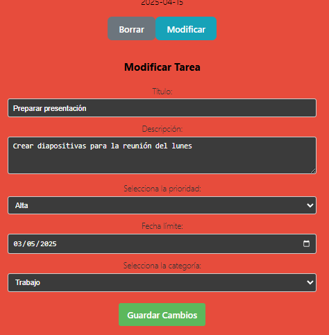
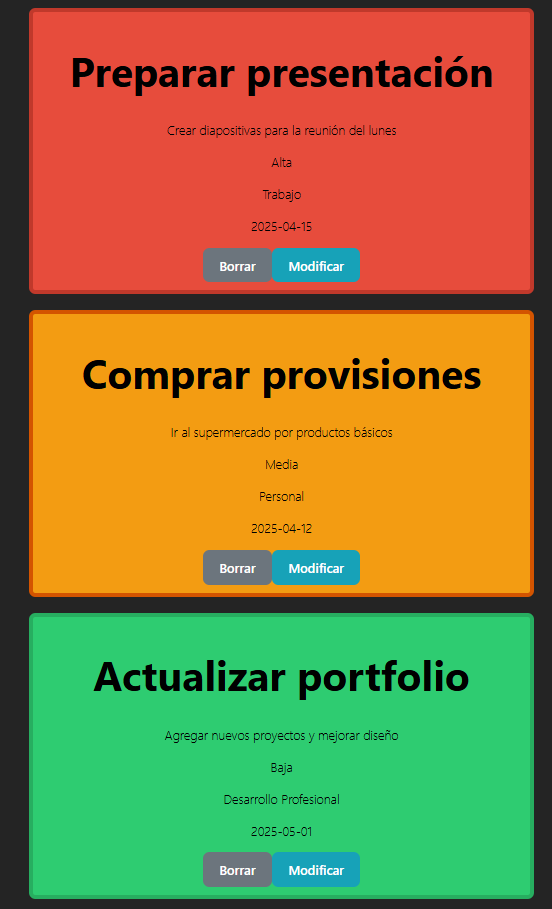
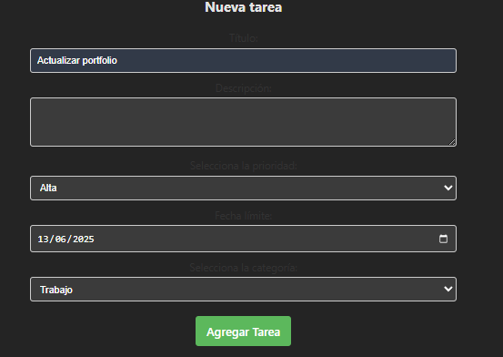

# 🚀 Vue To-Do List - Gestión Inteligente de Tareas

> Una aplicación moderna y completa de gestión de tareas construida con Vue 3, que combina funcionalidad avanzada con una experiencia de usuario excepcional.

[](https://vuejs.org/)
[](https://vitejs.dev/)
[](https://developer.mozilla.org/en-US/docs/Web/JavaScript)

---

## 📸 Capturas de Pantalla

✏️ Modal de Edición
<div align="center">
  
  <p><em>Modal limpio y funcional para editar tareas existentes</em></p>
</div>
🎨 Sistema de Prioridades
<div align="center">
  
  <p><em>Codificación visual por colores: Rojo (Alta), Naranja (Media), Verde (Baja)</em></p>
</div>
🖥️ Nueva tarea
<div align="center">
  
  <p><em>Creacion de nueva tarea para ver como funciona</em></p>
</div>


## 🎯 ¿Por qué Vue To-Do List?

Esta no es solo otra aplicación de tareas. Es una solución completa que te ayuda a:

- **Organizar eficientemente** tus tareas con categorías y prioridades
- **Nunca perder una fecha límite** con fechas de vencimiento claras
- **Mantener el enfoque** con una interfaz limpia y moderna
- **Trabajar en cualquier dispositivo** gracias al diseño responsivo

## ✨ Características Principales

### 🎨 Interfaz Visual Intuitiva
- **Codificación por colores**: Identifica prioridades al instante
  - 🔴 **Alta**: Rojo para urgencia máxima
  - 🟠 **Media**: Naranja para importancia moderada  
  - 🟢 **Baja**: Verde para tareas sin prisa
- **Diseño responsivo**: Perfecto en móvil, tablet y escritorio
- **Modo oscuro automático**: Se adapta a las preferencias del sistema

### 📋 Gestión Completa de Tareas
- ➕ **Crear tareas** con información detallada
- ✏️ **Editar en modal** para una experiencia sin distracciones
- 🗑️ **Eliminar tareas** completadas o innecesarias
- 🔄 **Actualizaciones en tiempo real** sin recargar la página

### 🏷️ Organización Inteligente
- **3 Niveles de Prioridad**: Alta, Media, Baja
- **Categorías Predefinidas**:
  - 💼 Trabajo
  - 🏠 Personal  
  - 📈 Desarrollo Profesional
- **Ordenamiento Inteligente**: Por título o categoría alfabéticamente
- 📅 **Fechas límite** para mejor planificación

### 🛠️ Funcionalidades Técnicas
- **Validación de formularios** robusta
- **Arquitectura basada en componentes** reutilizables
- **Sistema de eventos** para comunicación entre componentes
- **Estado reactivo** con Vue 3 Composition API

## 🚀 Inicio Rápido

### Prerrequisitos
```bash
Node.js >= 16.0.0
npm >= 7.0.0 (o yarn >= 1.22.0)
```

### Instalación en 3 pasos

1. **Clona y navega**
   ```bash
   git clone https://github.com/tu-usuario/vue-todo-app.git
   cd vue-todo-app
   ```

2. **Instala dependencias**
   ```bash
   npm install
   ```

3. **¡Ejecuta y disfruta!**
   ```bash
   npm run dev
   ```
   
   Abre http://localhost:5173 en tu navegador

### Construcción para Producción
```bash
npm run build
# Los archivos optimizados estarán en ./dist
```

## 🏗️ Arquitectura del Proyecto

```
src/
├── 📁 components/           # Componentes reutilizables
│   ├── 🎴 TarjetaComponent.vue    # Tarjeta individual de tarea
│   ├── 📝 Formulario.vue          # Formulario universal (crear/editar)
│   ├── 🪟 ModalComponent.vue      # Modal para edición
│   └── 🔘 Button.vue              # Botón reutilizable
├── 📄 App.vue              # Componente raíz y lógica principal  
├── 🚀 main.js              # Punto de entrada de la aplicación
└── 🎨 style.css            # Estilos globales y tema
```

## 🧩 Componentes Explicados

### `App.vue` - El Cerebro 🧠
El componente principal que orquesta toda la aplicación:
- **Gestión del estado global** de todas las tareas
- **Coordinación entre componentes** hijo
- **Funciones de ordenamiento** alfabético
- **Handlers para CRUD** (Crear, Leer, Actualizar, Eliminar)

### `TarjetaComponent.vue` - La Tarjeta Visual 🎴
Representa cada tarea individual con:
- **Visualización clara** de toda la información
- **Botones de acción** (Editar/Eliminar)
- **Colores dinámicos** según prioridad
- **Modal integrado** para edición

### `Formulario.vue` - El Cerebro de Datos 📝
Componente inteligente que maneja:
- **Modo dual**: Crear nuevas tareas o editar existentes
- **Validación en tiempo real** de campos obligatorios
- **Precarga automática** de datos para edición
- **Reset inteligente** del formulario

### `ModalComponent.vue` - La Ventana Flotante 🪟
Proporciona una experiencia de edición limpia:
- **Detección automática** de modo (crear/editar)
- **Títulos dinámicos** según el contexto
- **Cierre intuitivo** (ESC, click fuera, botón)

## 📊 Estructura de Datos

Cada tarea es un objeto con la siguiente estructura:

```javascript
{
  id: "unique_identifier",           // ID único generado automáticamente
  titulo: "Título de la tarea",      // Nombre descriptivo
  descripcion: "Descripción...",     // Detalles adicionales
  prioridad: "Alta",                 // "Alta" | "Media" | "Baja"
  fechaLimite: "2025-12-31",        // Formato YYYY-MM-DD
  completada: false,                 // Estado de completado
  categoria: "Trabajo"               // "Trabajo" | "Personal" | "Desarrollo Profesional"
}
```

## 🎨 Sistema de Colores y Temas

### Paleta de Prioridades
- **🔴 Alta Prioridad**: `#e74c3c` (Rojo urgente)
- **🟠 Media Prioridad**: `#f39c12` (Naranja moderado)  
- **🟢 Baja Prioridad**: `#2ecc71` (Verde relajado)

### Modo Oscuro Inteligente
La aplicación detecta automáticamente las preferencias del sistema y ajusta:
- Colores de fondo y texto
- Contraste optimizado para legibilidad
- Transiciones suaves entre modos

## 🔧 Scripts Disponibles

| Comando | Descripción |
|---------|-------------|
| `npm run dev` | 🔥 Servidor de desarrollo con hot-reload |
| `npm run build` | 📦 Construcción optimizada para producción |
| `npm run preview` | 👀 Preview local de la construcción |

## 🌟 Características Técnicas Destacadas

### Reactividad Avanzada
- **Vue 3 Composition API** para lógica más limpia
- **Referencias reactivas** para actualizaciones automáticas
- **Watchers inteligentes** para cambios en props

### Comunicación de Componentes
- **Sistema de eventos personalizado** para comunicación padre-hijo
- **Props tipadas** con validación automática
- **Emisión de eventos** para acciones de usuario

### Validación y UX
- **Validación de formularios** en cliente
- **Feedback inmediato** para errores
- **Estados de carga** para mejor experiencia

## 🚀 Próximas Funcionalidades

### En Desarrollo 🔧
- [ ] **Toggle de completado** para marcar tareas terminadas
- [ ] **Persistencia local** con localStorage
- [ ] **Búsqueda y filtros** avanzados
- [ ] **Arrastrar y soltar** para reordenar

### Futuro Cercano 🔮  
- [ ] **Notificaciones** de fechas límite próximas
- [ ] **Exportar tareas** a PDF/CSV
- [ ] **Múltiples listas** de proyectos
- [ ] **Colaboración en tiempo real**

### Visión a Largo Plazo 🌟
- [ ] **Sincronización en la nube**
- [ ] **Aplicación móvil nativa**
- [ ] **Integración con calendarios**
- [ ] **Analytics de productividad**

## 🤝 Contribuir al Proyecto

¡Tu contribución es bienvenida! Sigue estos pasos:

1. **Fork** el repositorio
2. **Crea una rama** para tu feature (`git checkout -b feature/increible-funcionalidad`)
3. **Commit** tus cambios (`git commit -m 'Agrega funcionalidad increíble'`)
4. **Push** a la rama (`git push origin feature/increible-funcionalidad`)
5. **Abre un Pull Request**

### Pautas de Contribución
- Mantén el código limpio y bien documentado
- Añade tests para nuevas funcionalidades
- Respeta la estructura de componentes existente
- Actualiza la documentación según sea necesario

## 📄 Licencia

Este proyecto está bajo la **Licencia MIT** - ve el archivo [LICENSE](LICENSE) para más detalles.

## 🙏 Agradecimientos

- **Vue.js Team** por el increíble framework
- **Vite Team** por las herramientas de desarrollo ultrarrápidas
- **Comunidad Open Source** por la inspiración constante

## 🔗 Enlaces Útiles

- [📚 Documentación de Vue 3](https://vuejs.org/)
- [⚡ Guía de Vite](https://vitejs.dev/)
- [🎨 Iconos de Lucide](https://lucide.dev/)
- [🚀 Despliegue con Netlify](https://netlify.com/)

---

<div align="center">

**Hecho con ❤️ usando Vue 3 y Vite**

[🌟 Star este proyecto](https://github.com/tu-usuario/vue-todo-app) • [🐛 Reportar Bug](https://github.com/tu-usuario/vue-todo-app/issues) • [💡 Solicitar Feature](https://github.com/tu-usuario/vue-todo-app/issues)

</div>
